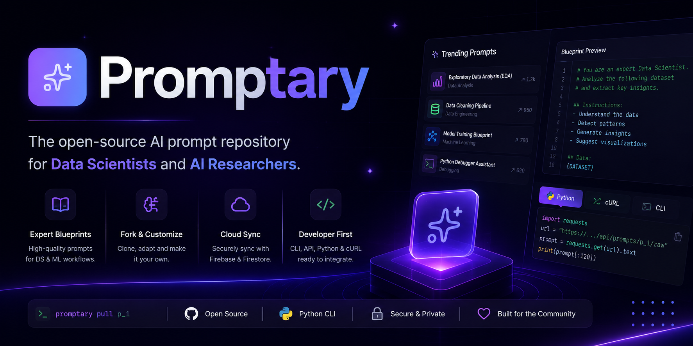

<p align="center">
  
</p>

--- 

# Promptary

## AI Prompt Knowledge Library for Data Science & Machine Learning

Promptary is a collaborative platform and premium prompt blueprint library built specifically for Data Scientists, Machine Learning Engineers, and AI practitioners.

It works as a prompt engineering workspace where professionals can discover, optimize, organize, reuse, and share high-quality AI workflows for real-world data projects.

From exploratory analysis to model development and debugging, Promptary helps teams transform scattered AI interactions into reusable engineering assets.

---

# 🛠️ Installation & Usage

Promptary provides multiple ways to access and integrate prompt blueprints into your AI workflows.

---

## 📦 Install Promptary CLI

Install the official Python CLI tool:

```bash
pip install promptary-cli
```

Verify the installation:

```bash
promptary --version
```

---

# 🚀 Retrieve a Prompt Blueprint

Each Promptary blueprint has a unique identifier.

Example:

```
p_1
```

You can retrieve any blueprint dynamically using the Promptary CLI or API.

---

# 💻 Using Promptary CLI

Pull a blueprint directly from Promptary:

```bash
promptary pull p_1
```

This retrieves the latest version of the prompt template.

---

# 🐍 Using Python

Blueprints can be loaded directly into Python workflows:

```python
import requests

prompt_id = "p_1"

url = f"https://ais-dev-72ol4usdksqlfvm5j3qmcj-367441520387.us-west1.run.app/api/prompts/{prompt_id}/raw"

prompt_template = requests.get(url).text

print("Loaded blueprint prompt successfully!")
print(prompt_template[:120] + "...")
```

Example output:

```
Loaded blueprint prompt successfully!

You are an expert Data Scientist specialized in...
```

Useful for:

- Jupyter Notebooks
- AI agents
- automation scripts
- ML workflows

---

# 🌐 Using cURL

Retrieve the raw prompt directly from the API:

```bash
curl -s "https://ais-dev-72ol4usdksqlfvm5j3qmcj-367441520387.us-west1.run.app/api/prompts/p_1/raw"
```

The API returns the blueprint as plain text.

---

# 🔌 Integration Workflow

Promptary blueprints can be integrated into:

- Python applications
- Data Science pipelines
- AI agents
- LLM automation workflows
- Internal developer tools

The goal of Promptary is to make AI workflows:

- reusable
- versioned
- shareable
- easy to integrate

---

# 📚 Example Use Case

A Data Scientist can:

1. Discover a blueprint in Promptary.
2. Pull it using the CLI or API.
3. Customize the workflow.
4. Integrate it into a notebook or production pipeline.
5. Share improvements back with the community.

Promptary turns AI prompts into reusable engineering assets.

---

# 🎨 Design Philosophy

Promptary is designed for long technical sessions, combining a professional developer experience with a modern AI-native interface.

### Premium Dark Interface
A focused dark environment built with deep grayscale and slate tones, enhanced with subtle purple and emerald accents.

### Developer-Focused Typography
A refined typography system combining:

- Sans-serif fonts for readability and navigation.
- Mono fonts (JetBrains Mono) for:
  - code snippets
  - commands
  - technical metadata
  - development indicators

### Smooth Interaction
Polished animations, transitions, and responsive components create a fluid experience optimized for productivity.

---

# 🚀 Core Features

## 1. Prompt Blueprint Library

A structured catalog of high-quality AI workflows organized around key Data Science domains.

### Exploratory Data Analysis (EDA)
Prompts designed to accelerate:
- dataset understanding
- pattern discovery
- statistical exploration
- visualization workflows

### Data Cleaning
Reusable workflows for:
- missing value handling
- anomaly detection
- outlier analysis
- data normalization

### Machine Learning & Modeling
Prompt architectures for:
- model experimentation
- hyperparameter optimization
- pipeline design
- evaluation strategies

### Debugging & Development
AI-assisted troubleshooting for:
- Python
- SQL
- PyTorch
- ML pipelines
- complex errors

---

# 2. Collaborative Prompt Ecosystem

Inspired by modern software development workflows.

## Fork System

Users can clone existing prompt blueprints and customize them for their own projects.

Each fork maintains:
- original structure
- modifications
- contributor ownership
- evolution history

Turning prompts into reusable community-driven assets.

## Community Publishing

Professionals can publish their own workflows with:

- author information
- role
- tags
- professional links
- technical context

---

# 3. Cloud Architecture & Data Persistence

Promptary combines cloud synchronization with local performance.

## Authentication

Secure developer authentication powered by Firebase Google Auth.

Ensures:
- personalized libraries
- user profiles
- contribution ownership

## Cloud Database

Real-time synchronization using Cloud Firestore.

Features:
- persistent prompt storage
- community contributions
- scalable data structure
- secure access rules

## Personal Library

Users can save favorite prompts locally for fast access through a personalized collection.

---

# 4. AI Development Utilities

Each prompt blueprint includes a detailed inspection environment.

## Code Integration Snippets

Generate ready-to-use examples for:

- Python API calls
- modern AI SDKs
- pip installation commands
- curl requests

Designed for direct integration into:

- Jupyter Notebooks
- development environments
- terminal workflows

---

# 5. Community Ranking System

Promptary uses interaction signals to surface valuable workflows.

Users can provide feedback through:

- 👍 Likes
- 👎 Dislikes

Helping identify:

- trending prompts
- high-performing workflows
- community favorites

---

# Vision

Promptary aims to become the GitHub for AI prompts in Data Science: a place where professionals build, share, improve, and reuse AI knowledge instead of starting from zero every time.